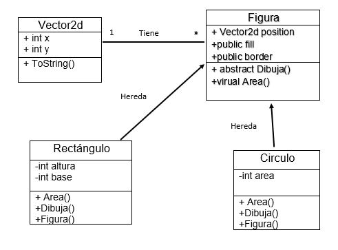

# Tarea 3 y 4
## Tarea 3
1.  Define: Clase Base, Clase Derivada.

***Clase Base:*** es aquella que no dependen ninguno de sus atributos u objetos de la clase de alguna otra clase, se podría decir que en términos de herencia, seria la clase padre, la clase que se mantiene fija, en el aspecto de herencia.
Es también por así llamarlo la clase principal de un programa, seria la clase primaria sin incluir la clase main en donde se corre todo el programa en si.

***Clase Detivada:*** son clases que dependen de las clases bases, ya que algunos de sus métodos son también heredados, y muchas veces, el compilador arrojara malos resultados, ya que al ser dependientes estas clases, a veces podrán generar errores lógicos.

2.  Haz un diagrama UML donde se muestre la relación de herencia entre las  clases Figura, Recangulo y Circulo como vimos en clase.
3. ¿ Indica cuales son las clases base y las derivadas.

4. ¿Que es herencia simple y herencia múltiple? ¿En c# se puede hacer herencia múltiple? 

*Únicamente hay herencia múltiple de interfaz, pero no de clase*

***Herencia simple:*** La herencia simple es una relación entre una clase padre (clase base) y una clase hija (clase derivada)  La herencia es simple cuando la clase derivada que estamos considerando sólo tiene una clase base

***Herencia Multiple:***La herencia múltiple se encuentra en aquellos casos en los que una clase derivada tiene varias clases base (al menos, más de una).

5. Escribe el programa de Figura como vimos en clase, donde agregues varios tipos de figuras a una lista y recorre la lista llamando a un metodo de las figuras, además :
    1. Se sobrecarguen los constructores y se acceda a los constructores de la clase base 
    2. Explica para que nos sirve la palabra base
    3. Haz el método Dibuja() que sea virtual y redefinelo en solo una de las clases derivadas.
## Tarea 4
### ***Parte 1***
1. **¿Qué valores imprimen las lineas (1) y (2) ?**
R=10 y 10
2. **Redefine el método Display en el espacio indicado, una vez redefinido el método, ¿qué valores imprimen las lineas (1) y (2)?**
R=10 y 15
3. **¿Que palabra debes agregar en la linea (public _______ string Display())al definir A.Display()** R=virtual

### ***Parte 2***
1. **Completa el programa.**
2. **Hay un error en uno de los puntos (A)(B)(C)(D). ¿Cuál es y por qué?**
R: 

B= se utiliza string en lugar de void ya que devuelve un valor

D=No se puede crear objetos de una clase abstracta

3. **¿Qué método se debe implementar obligatoriamente en ambas clases y por qué?**

R:     El método abstracto por qué si no tendrá un método no ejecutable, lo que la fuerza a ser una subclase abstracta.

4. **¿Por qué no se ponen las llaves en (B)?, ¿Cuándo si se pondrían?**

R:     No proporciona una implementación real, no hay ningún cuerpo de método

5. **¿Qué pasa si el método Afina() lo hacemos virtual en lugar de abstract?**

R:     Tendríamos que cambiar la clase para que no sea abstracta
### ***Parte 3***
Implementa el programa utilizando interfaces en lugar de herencia.

